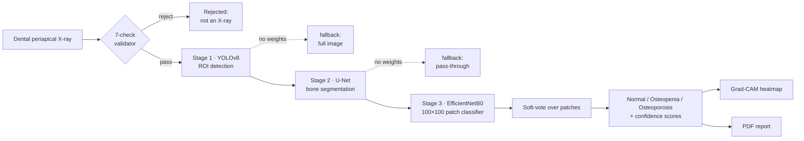

# 🦴 OsteoScan

### Early Detection of Osteoporosis from Dental X-rays

**A deep-learning system that screens for osteoporosis from dental periapical radiographs — and an honest account of what such a model can and cannot do.**

[](https://github.com/MARCUS-00/Early-Detection-of-Osteoporosis-using-Dental-X-rays/actions)
[](https://www.python.org/)
[](https://www.tensorflow.org/)
[](https://flask.palletsprojects.com/)
[](tests/test_app.py)
[](coverage.xml)
[](https://github.com/astral-sh/ruff)
[](LICENSE)
[](https://manojkumar724-osteoscan.hf.space)

> [!WARNING]
> **Research prototype — not a medical device.** Evaluated on **13 patient sources**, so confidence intervals are wide. This tool is a screening-aid proof of concept and must **never** be used for diagnosis or treatment decisions.

---

## 📌 The short version

Dental X-rays are taken routinely; osteoporosis screening (DXA) is not. If bone-density loss leaves a detectable signature in the trabecular texture of a dental radiograph, a dentist could flag at-risk patients for a real bone scan. OsteoScan tests that idea with an EfficientNetB0 classifier, wrapped in a clinical-style web app with authentication, explainability, and PDF reporting.

**The headline of this project isn't the accuracy — it's the integrity.** The project's first pipeline reported **97.28% accuracy**. On audit, that number turned out to be a **patient-level data-leakage artifact**: image patches from the same patient were split across both training and test sets, so the model was memorizing patients, not learning osteoporosis. I rebuilt the evaluation as strict **Leave-One-Source-Out (LOSO)** cross-validation and report the honest result below — a 36-point drop, and a far more trustworthy number.

---

## 📊 Results (honest, leakage-free)

Evaluated under **Leave-One-Source-Out cross-validation** across all 13 patient sources. Each fold trains on 12 patients and tests on the 1 unseen patient — the only honest measure of generalization when patches are correlated within a patient.

| Metric                          | EfficientNetB0 (frozen) | Brightness baseline |
| :------------------------------ | :---------------------: | :-----------------: |
| **Accuracy (LOSO)**             |   **61.5%** (8 / 13)    |   53.8% (7 / 13)    |
| **Macro-F1**                    |        **0.594**        |        0.533        |
| F1 — Normal                     |          0.500          |          —          |
| F1 — Osteopenia                 |          0.615          |          —          |
| F1 — Osteoporosis               |          0.667          |          —          |
| **Bootstrap 95% CI (accuracy)** |   **[30.8%, 84.6%]**    |          —          |

> **Read this honestly:** the model beats a trivial brightness baseline on **both** metrics, but the bootstrap CI is wide and overlaps the baseline. The result is **suggestive, not decisive** — a direct consequence of only 13 sources. The discarded 97.28% appears nowhere as a result; it is documented only as the leakage I corrected.

---

## 🧠 How it works

A three-stage inference pipeline with **honest graceful fallback**:



> [!NOTE]
> **About stages 1 & 2 — full transparency.** YOLOv8 and U-Net are fully implemented, runnable inference _and_ training modules — but they ship **without weights**, because the dataset contains no annotated bounding boxes or segmentation masks to train them on. When weights are absent the pipeline gracefully falls back to classifying the patch directly, and the UI honestly labels each stage **"Fallback"** vs **"AI model."** Only the **EfficientNetB0 classifier** is a trained, evaluated model. I wired the full architecture rather than faking stages I couldn't train.

### The classifier (architecture verified from the released weights)

```
Input "patch_0_255"  (100×100×3, raw [0,255] — EfficientNet rescales internally)
  → RandomFlip                         # flips-only augmentation, inside the model
  → EfficientNetB0  (ImageNet, frozen) # transfer learning; backbone not updated
  → Dropout(0.5) → Dense(64, ReLU) → Dropout(0.4) → Dense(3, softmax)
```

**Why frozen, not fine-tuned?** With only 13 subjects, fine-tuning overfit hard (training accuracy ≈ 99.9% while LOSO collapsed). Freezing the ImageNet backbone and training only the head generalized better — chosen empirically, not by assumption. EfficientNetB0 was selected over the originally proposed MobileNetV2 after it outperformed on every metric.

**Preprocessing:** border removal → CLAHE contrast enhancement (LAB L-channel) → non-overlapping 100×100 patches → per-patch inference → **soft-vote** (average class probabilities) for the per-image decision.

---

## ✨ Features

- 🩻 **Drag-and-drop upload** of dental X-rays (JPG / PNG / BMP)
- 🛡️ **7-check heuristic validator** that rejects obvious non-X-rays (colour photos, blanks, screenshots) before inference, plus a panoramic-image warning
- 🔬 **Grad-CAM explainability** — heatmap overlay showing which regions drove the prediction (with a correct recursive search through the nested EfficientNetB0 sub-model)
- 📄 **One-click PDF reports** (fpdf2) with patient info, diagnosis badge, confidence bars, and the Grad-CAM overlay
- 🔐 **Authentication + role-based access** (Flask-Login) — `admin` and `dentist` roles
- 🗃️ **Prediction history** with row-level ownership — dentists see only their own records; admins see all
- 🧑‍⚕️ **Admin dashboard** — user management, role toggling, prediction audit
- 🐳 **Dockerised** with a one-worker gunicorn server, ready for free-tier deployment

---

## 🗂️ Project structure

```
.
├── wsgi.py                      # WSGI entry point  (gunicorn wsgi:app)
│
├── osteoscan/                   # ── application package ──
│   ├── __init__.py              #   create_app() factory: config, extensions, blueprints, seed
│   ├── config.py                #   env-driven config (DATA_DIR, MODEL_PATH, limits)
│   ├── extensions.py            #   SQLAlchemy + Flask-Login singletons
│   ├── models.py                #   User, Prediction  (row-level access control)
│   ├── main.py                  #   main blueprint: upload, predict, history, report, health
│   ├── auth.py                  #   auth blueprint + admin/dentist RBAC decorators
│   ├── admin.py                 #   admin dashboard blueprint
│   ├── reports.py               #   fpdf2 PDF report generator
│   ├── ml/                      #   ── machine-learning layer ──
│   │   ├── inference.py         #     CLAHE · patch extraction · EfficientNetB0 soft-vote
│   │   ├── pipeline.py          #     3-stage orchestrator with graceful fallback
│   │   ├── gradcam.py           #     Grad-CAM overlay (recursive nested-submodel gradients)
│   │   ├── validate.py          #     7-check X-ray validator + panoramic warning
│   │   └── detectors/
│   │       ├── yolo.py          #       YOLOv8 ROI detector   (fallback-only: no weights)
│   │       └── unet.py          #       U-Net bone segmenter  (fallback-only: no weights)
│   ├── templates/               #   Jinja2 templates (navy/teal clinical theme)
│   └── static/css/style.css
│
├── training/                    # standalone scripts, NOT part of the deployed app
│   ├── train_yolo.py            #   runnable YOLO training (awaiting annotated data)
│   └── train_unet.py            #   runnable U-Net training (awaiting masks)
│
├── model/
│   ├── osteoporosis_efficientnetb0.keras   # the deployed classifier
│   └── README.md                           # model card + SHA-256
├── kaggle/kaggle_cv.ipynb       # Leave-One-Source-Out training/eval notebook
├── tests/test_app.py            # pytest suite (14 tests)
│
├── Dockerfile · docker-compose.yml · render.yaml     # deployment
├── .github/workflows/ci.yml                           # lint + test CI
└── requirements.txt · pyproject.toml · .pre-commit-config.yaml
```

---

## 🚀 Quick start

> Requires Python 3.11+ and the model file at `model/osteoporosis_efficientnetb0.keras` (already committed).

### Easiest: one command

```bash
python run.py
```

Creates the virtualenv, installs dependencies, and starts the app at
http://127.0.0.1:5000. First run downloads TensorFlow (slow); later runs skip
the install and start in seconds. Default login: `admin` / `admin123`.

### Manual setup

```bash
git clone https://github.com/MARCUS-00/Early-Detection-of-Osteoporosis-using-Dental-X-rays.git
cd Early-Detection-of-Osteoporosis-using-Dental-X-rays

python -m venv .venv && source .venv/bin/activate     # Windows: .venv\Scripts\activate
pip install -r requirements.txt

export SECRET_KEY="$(python -c 'import secrets; print(secrets.token_hex(32))')"
export ADMIN_PASSWORD="choose-a-strong-password"      # do NOT leave the default

python wsgi.py       # → http://127.0.0.1:5000
```

A default `admin` account is seeded on first run using `ADMIN_PASSWORD`. Sign in, upload a dental X-ray, and you'll get a classification, a Grad-CAM heatmap, and a downloadable report.

### 🐳 Docker

```bash
docker compose up --build        # → http://localhost:5000
```

---

## ☁️ Deployment — Hugging Face Spaces

> [!IMPORTANT]
> **Resource requirement:** TensorFlow inference for this model peaks around **~900 MB RAM**. Deploy on a host with **≥ 1 GB RAM**. Render's **free** tier (512 MB) is **too small** and will OOM — use Hugging Face Spaces below.

**Hugging Face Spaces is the recommended (and free) host.** Its CPU tier provides **16 GB RAM** and runs Docker natively, so the included `Dockerfile` deploys almost as-is. The YAML header at the top of this file (`sdk: docker`, `app_port: 5000`) _is_ the Space configuration — Spaces reads it automatically, so no extra config is needed.

**1 · Create the Space.** On [huggingface.co/new-space](https://huggingface.co/new-space): pick **Docker** as the SDK, set visibility to **Public**, and name it (e.g. `osteoscan`).

**2 · Push the repo.** The 18 MB `.keras` model must go through **git-LFS** (Hugging Face requires LFS for files > 10 MB):

```bash
git lfs install
git lfs track "*.keras" && git add .gitattributes
git remote add space https://huggingface.co/spaces/MANOJKUMAR724/osteoscan
git push space main
```

If the model was already committed to plain git and the push is rejected for size, either re-add it after `git lfs track`, or upload `model/osteoporosis_efficientnetb0.keras` through the Space's **Files** tab in the browser.

**3 · Set secrets.** In the Space's **Settings → Variables and secrets**:

| Type     | Key              | Value                                                                           |
| :------- | :--------------- | :------------------------------------------------------------------------------ |
| Secret   | `ADMIN_PASSWORD` | your chosen admin password                                                      |
| Secret   | `SECRET_KEY`     | 32-char random hex — `python -c "import secrets; print(secrets.token_hex(32))"` |
| Variable | `DATA_DIR`       | `/app/data`                                                                     |

**4 · Wait for the build (~5 min).** The app goes live at `https://manojkumar724-osteoscan.hf.space`. The first request after the Space has been idle is a cold start while the model loads, so give it a few seconds.

> [!NOTE]
> Storage on the free tier is **ephemeral** — uploads and the SQLite database are wiped when the Space restarts or sleeps. The `admin` account is re-seeded from `ADMIN_PASSWORD` on every boot, so login always works. This is expected and fine for a public demo.
>
> The deployed app is reachable at `https://manojkumar724-osteoscan.hf.space` — use this URL after deployment, not the repository page URL.
>
> The deployed Space uses the `ADMIN_PASSWORD` secret on every startup and does not persist runtime `data/` between restarts.

**Render (paid tier).** A `render.yaml` blueprint is also included for Render's paid tier (≥ 1 GB RAM). The container entry point is `wsgi:app`.

---

## 🧪 Testing & code quality

```bash
pytest                 # 14 tests (model test auto-skips without TensorFlow/weights)
ruff check .           # lint  — all checks pass
ruff format .          # format
pre-commit run --all-files
```

CI is configured via the GitHub Actions workflow below (lint + tests on every push). The codebase is fully `ruff`-clean and pre-commit hooked.

<details>
<summary>📋 <code>.github/workflows/ci.yml</code> — drop this in to activate the CI badge</summary>

```yaml
name: CI

on:
  push:
    branches: ["**"]
  pull_request:
    branches: ["**"]

jobs:
  lint:
    name: Lint (ruff)
    runs-on: ubuntu-latest
    steps:
      - uses: actions/checkout@v4
      - uses: actions/setup-python@v5
        with:
          python-version: "3.12"
          cache: pip
      - run: pip install ruff
      - run: ruff check .
      - run: ruff format --check .

  test:
    name: Test (Python ${{ matrix.python-version }})
    runs-on: ubuntu-latest
    strategy:
      matrix:
        python-version: ["3.11", "3.12"]

    steps:
      - uses: actions/checkout@v4
        with:
          lfs: false # model weights are not needed in CI; the test uses a size guard to skip LFS pointer stubs

      - name: Install system deps for OpenCV
        run: sudo apt-get update && sudo apt-get install -y libgl1 libglib2.0-0

      - uses: actions/setup-python@v5
        with:
          python-version: ${{ matrix.python-version }}
          cache: pip

      - name: Install Python dependencies
        run: pip install -r requirements.txt pytest pytest-cov

      - name: Run tests with coverage
        # Model file is not present in CI (gitignored). Model-dependent test is skipped via a size check that avoids running on LFS pointer stubs.
        run: pytest --cov=osteoscan --cov-report=xml --cov-report=term

      - name: Upload coverage report
        uses: actions/upload-artifact@v4
        if: matrix.python-version == '3.12'
        with:
          name: coverage-xml
          path: coverage.xml
```

</details>

---

## 📁 Dataset

|               |                                                                                           |
| :------------ | :---------------------------------------------------------------------------------------- |
| **Source**    | Mendeley Data — _Dataset of Dental Periapical Radiograph for Osteoporosis Classification_ |
| **DOI**       | [10.17632/7xgzy69fw2.1](https://doi.org/10.17632/7xgzy69fw2.1)                            |
| **License**   | CC BY 4.0                                                                                 |
| **Used here** | 13 of 31 subjects — 3 Normal, 6 Osteopenia, 4 Osteoporosis                                |
| **Patches**   | 75,075 augmented 100×100 patches                                                          |

A strict leakage guard (`assert len(sources) == 13`) ensures every patient stays within a single LOSO fold.

---

## ⚠️ Limitations & responsible use

- **Tiny evaluation set (n = 13)** → very wide 95% CI [30.8%, 84.6%]; results are indicative, not conclusive.
- **Source-level class imbalance** (only 3 Normal sources → lowest per-class F1).
- **Single dataset, no external validation** — generalization across clinics/scanners is unknown.
- **Stages 1 & 2 (YOLO/U-Net) are fallback-only** — no annotated data exists to train them.
- **Not a diagnostic tool.** No regulatory clearance. Outputs are a screening signal at best, to be confirmed by a clinical DXA scan.

---

## 🗺️ Roadmap

- [ ] Collect more patient sources (the single highest-leverage improvement — narrows the CI)
- [ ] Annotate data so YOLOv8 / U-Net become real, trained stages
- [ ] External validation on an independent dataset
- [ ] Probability calibration + screening-threshold tuning

---

## 🔬 Model provenance

|              |                                                                                              |
| :----------- | :------------------------------------------------------------------------------------------- |
| File         | `model/osteoporosis_efficientnetb0.keras`                                                    |
| Architecture | Frozen EfficientNetB0 + RandomFlip + `Dropout(0.5) → Dense(64) → Dropout(0.4) → Dense(3)`    |
| Parameters   | 4,131,750                                                                                    |
| SHA-256      | `0ff874482a860b6466882ac25c70655d3f38c0a02d10d1bee98ed24884e172c5`                           |
| Training     | Leave-One-Source-Out CV, Adam, sparse categorical cross-entropy, subject-level class weights |

```bash
sha256sum model/osteoporosis_efficientnetb0.keras   # verify the released weights
```

---

## 👤 Author

**Manoj Kumar G** &nbsp;·&nbsp;

---

## 📜 License

Released under the [MIT License](LICENSE) © 2025 Manoj Kumar G.

## 🙏 Acknowledgments

Dataset by the authors of the Mendeley _Dental Periapical Radiograph for Osteoporosis Classification_ collection (CC BY 4.0). Built with TensorFlow/Keras, Flask, OpenCV, and EfficientNet.

---

**RESEARCH PROTOTYPE — NOT FOR CLINICAL USE.**
Results do not constitute a medical diagnosis.
